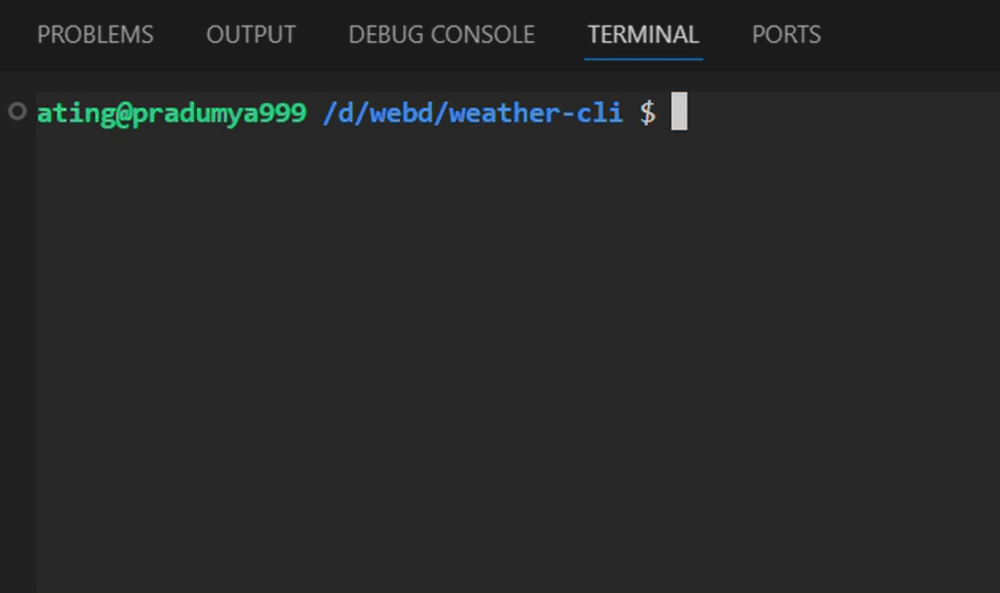

# weather-cli

A simple and lightweight **Weather CLI tool** built using **Node.js**, **Axios**, and **Commander**, designed to quickly fetch real-time **weather** and **air quality** information for any location.

## Features

- **Get instant weather updates** for any city worldwide  
- **View temperature, feels-like temperature, humidity & weather condition**  
- **Check Air Quality Index (AQI)** along with **PM2.5 concentration**  
- **Colored output** for better clarity using `chalk`  
- **Safety recommendations** if air quality is poor  
- **Fast and minimal command-line usage**  

## How It Works

The CLI fetches data from the **OpenWeather API**:
- Converts the entered location into geographic coordinates using the **Geocoding API**  
- Retrieves detailed weather statistics from the **Weather API**  
- Fetches air pollution data from the **Air Pollution API**  
- Displays the results in a clean, readable format directly in the terminal

  

